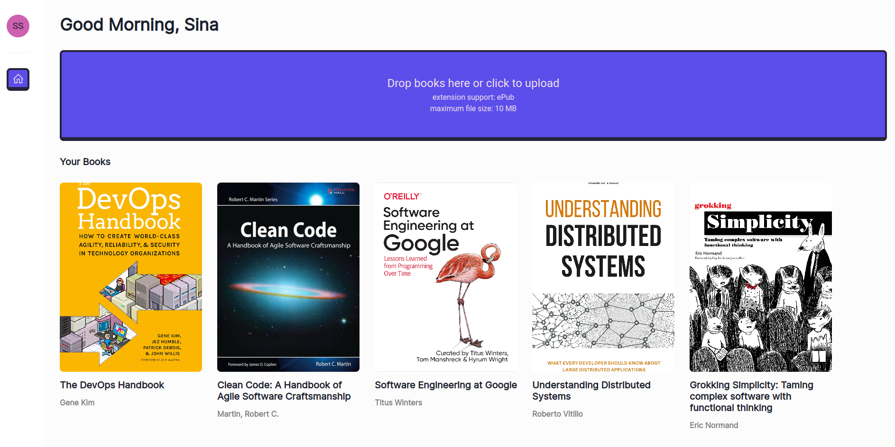

# A minimal epub reader that keeps your progress

## What is this and who is it for 🤷‍♀️

I do React consulting and this is a showcase product I've built in my spare time. Additionally, I read books. So I built something to help me be more productive on this.  

## Features

- Proven, scalable, and easy to understand project structure
- Written in modern React, only functional components with hooks
- Simple local React state management, with [jotai](https://jotai.org/)
- Local database, indexed-db
- Keeps your progress while you are navigating between chapters

## Setting up development environment 🛠

- Install [node](https://nodejs.org/en)
- install [pm2](https://pm2.io/docs/plus/overview/)
- `npm run build`
- `pm2 start "npm run start -- -p 5000" --name book-reader`

## License

[MIT](https://opensource.org/licenses/MIT)
